# OpenBcon

**The Open Source AI Platform for Funding & Business Consultants**

OpenBcon helps consultants, advisors, incubators, and funding teams run the full workflow in one place:

- discover funding programs
- assess business readiness
- manage company and client records
- generate funding-ready business plans
- organize applications, templates, resources, and reports

> Community edition: `AGPL-3.0-or-later`
>
> Commercial licensing available for private deployments, closed-source modifications, white-label/OEM distribution, implementation services, and ongoing support.
>
> See [COMMERCIAL-LICENSE.md](./COMMERCIAL-LICENSE.md) and [CLA.md](./CLA.md).

## Why OpenBcon

Funding consultants and business advisors still spend too much time on repetitive work:

- searching and comparing grant or loan programs
- collecting company information from clients
- rewriting business plans and funding narratives
- tracking applications, deadlines, and next actions
- building reports and export packages manually

OpenBcon turns that fragmented process into one AI-assisted workspace.

## Who It's For

OpenBcon is designed for teams that help businesses secure funding:

- funding consultants and grant writers
- business advisors and coaches
- incubators and accelerators
- economic development organizations
- partner networks, internal advisory teams, and multi-client workspaces

## Core Capabilities

- **AI business plan generation**: turn company and funding-program context into a structured funding-ready package
- **Funding readiness workflows**: assess strengths, risks, and missing inputs before submission
- **Client and company management**: organize founder profiles, business details, and working records
- **Funding program database**: manage grants, loans, and opportunity sources in one directory
- **Partner and admin workspace**: configure modules, branding, landing-page content, legal links, data sources, models, payment settings, and workspace behavior
- **Resource and template libraries**: centralize templates, social resources, tools, and reusable content
- **Google Sheets and Airtable integrations**: connect external resource sources with admin-managed sync
- **Open-source customization**: self-host, extend, rebrand, or commercialize under the project's dual-license model

## Product Surfaces

The repository currently includes three product surfaces:

- `/` - public landing page
- `/dashboard` - user workspace
- `/admin` - platform configuration console

Every workspace module uses a flat route such as `/funding-readiness`, `/quick-generate`, and `/grants-loans`.

Built-in auth entry flows are also included for `/login`, `/signup`, `/forgot-password`, and `/reset-password`.

## Demo Preview

Live demo and short product walkthroughs are planned. Until then, the repository includes a visual snapshot of the current product experience.

<table>
  <tr>
    <td align="center">
      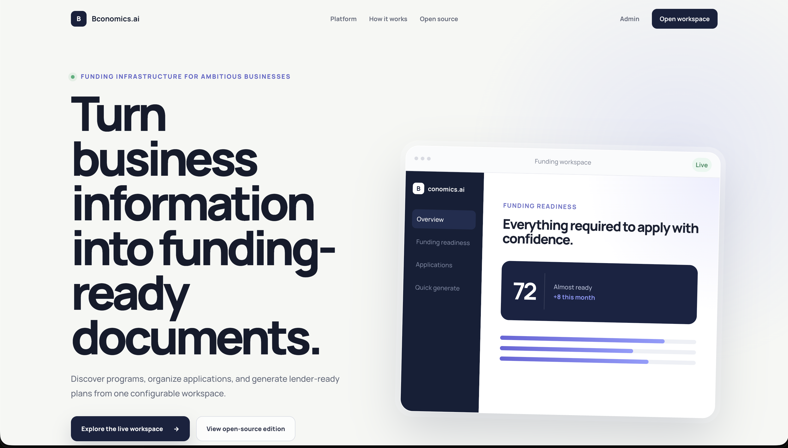<br />
      <sub>Landing Page</sub>
    </td>
    <td align="center">
      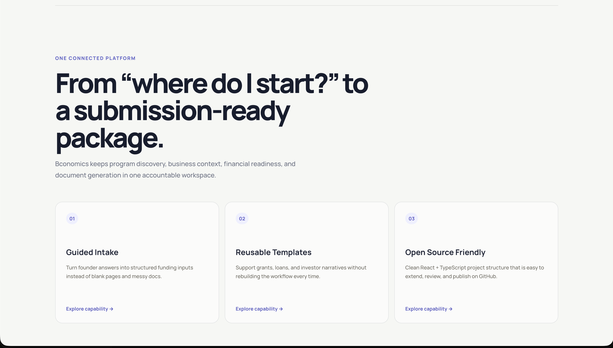<br />
      <sub>Landing Page 2</sub>
    </td>
    <td align="center">
      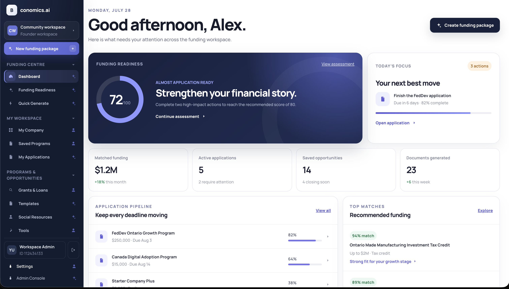<br />
      <sub>Dashboard Overview</sub>
    </td>
  </tr>
</table>

## Screenshot Gallery

The current repository snapshot includes the landing experience, dashboard workspace, directories, and Quick Generate flow.

<table>
  <tr>
    <td align="center">
      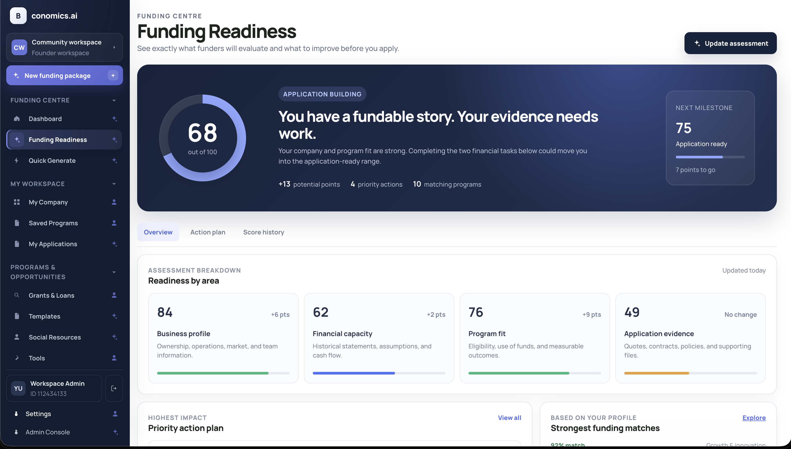<br />
      <sub>Funding Readiness</sub>
    </td>
    <td align="center">
      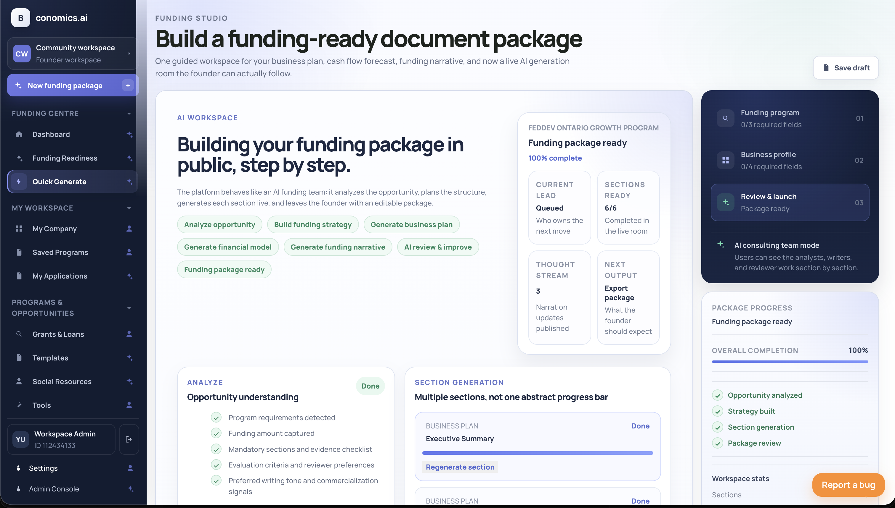<br />
      <sub>Quick Generate</sub>
    </td>
    <td align="center">
      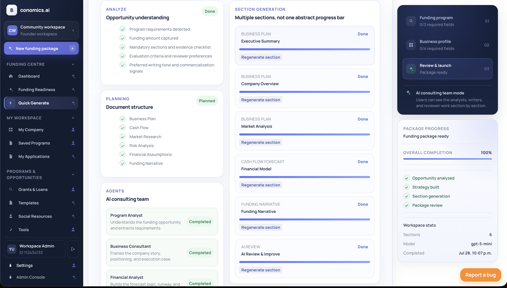<br />
      <sub>Quick Generate - Result Preview</sub>
    </td>
  </tr>
  <tr>
    <td align="center">
      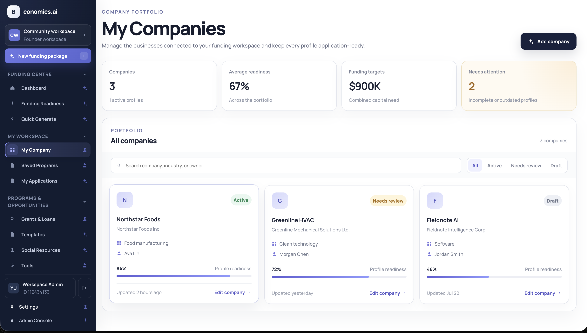<br />
      <sub>My Company</sub>
    </td>
    <td align="center">
      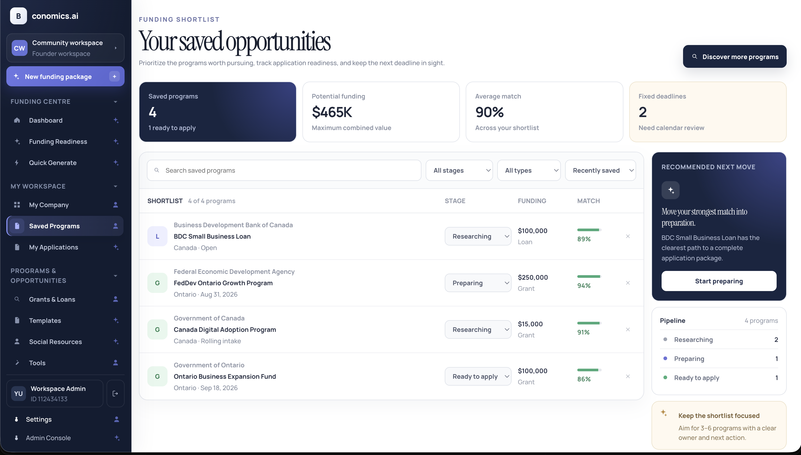<br />
      <sub>Saved Programs</sub>
    </td>
    <td align="center">
      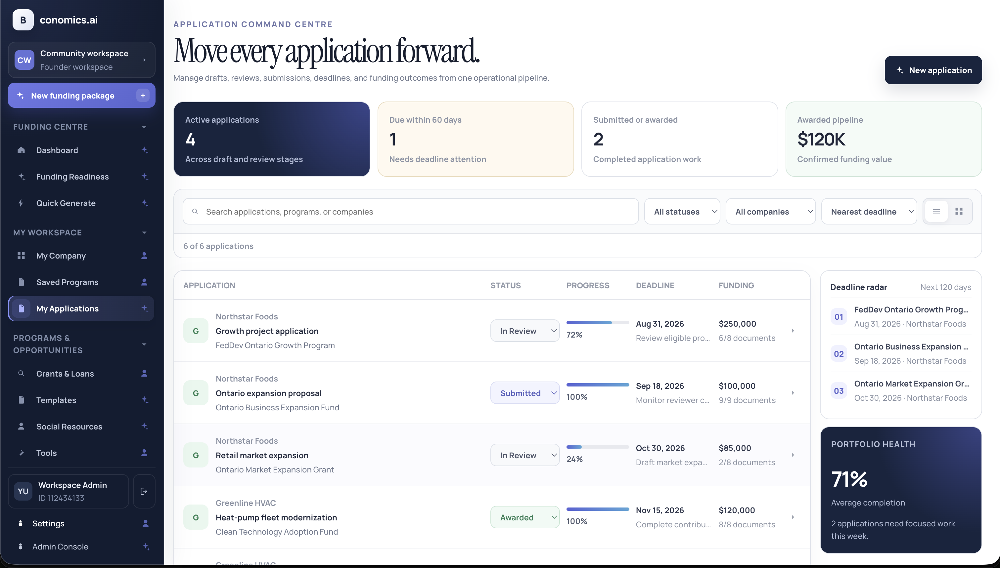<br />
      <sub>My Applications</sub>
    </td>
  </tr>
  <tr>
    <td align="center">
      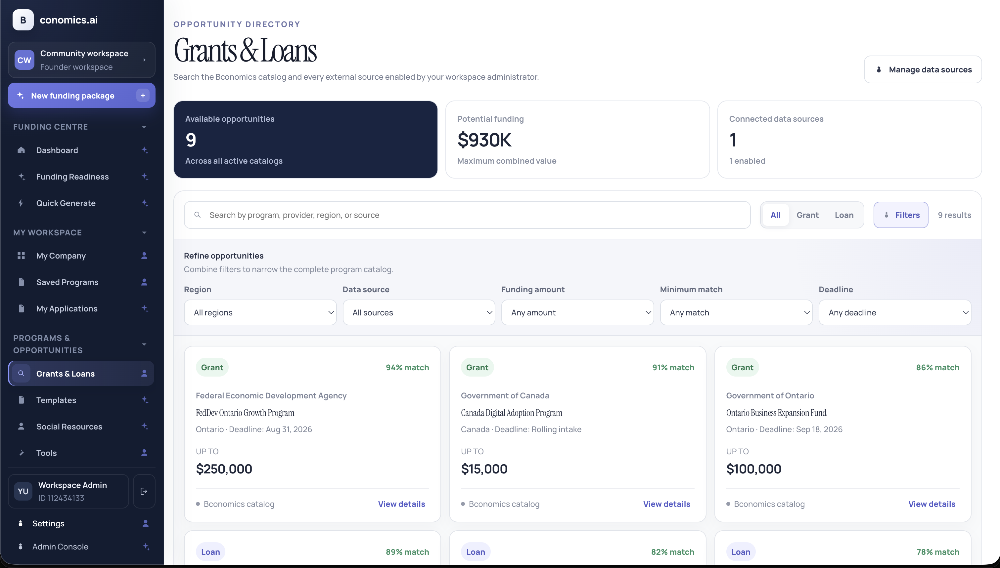<br />
      <sub>Grants &amp; Loans</sub>
    </td>
    <td align="center">
      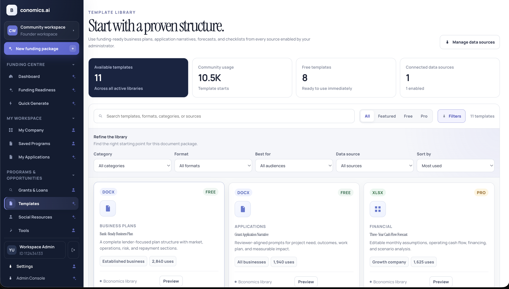<br />
      <sub>Templates</sub>
    </td>
    <td align="center">
      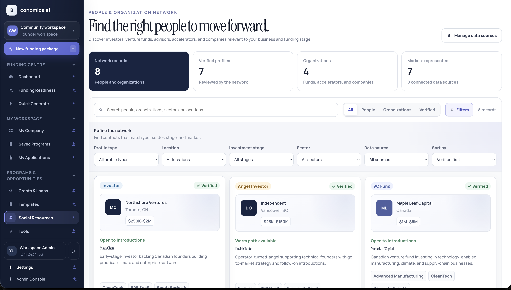<br />
      <sub>Social Resources</sub>
    </td>
  </tr>
  <tr>
    <td align="center">
      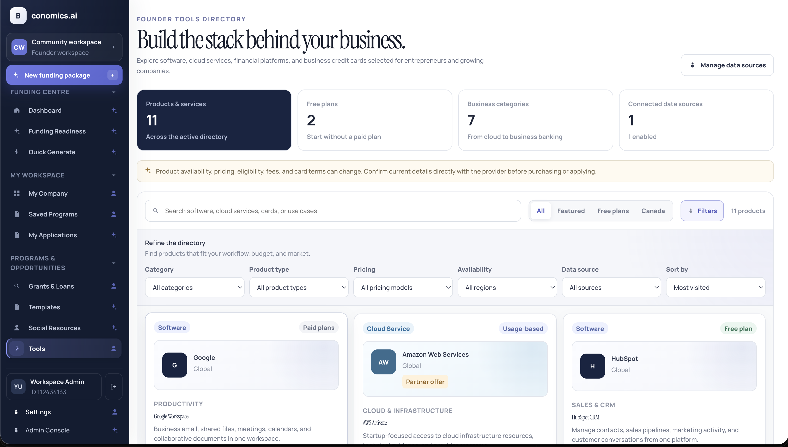<br />
      <sub>Tools</sub>
    </td>
    <td align="center">
      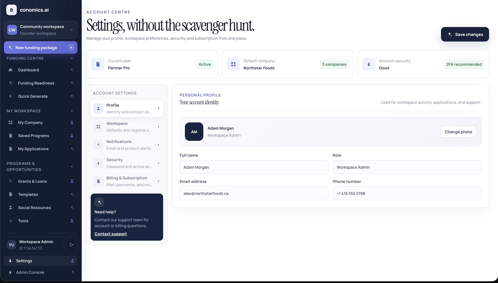<br />
      <sub>Settings</sub>
    </td>
    <td align="center">
      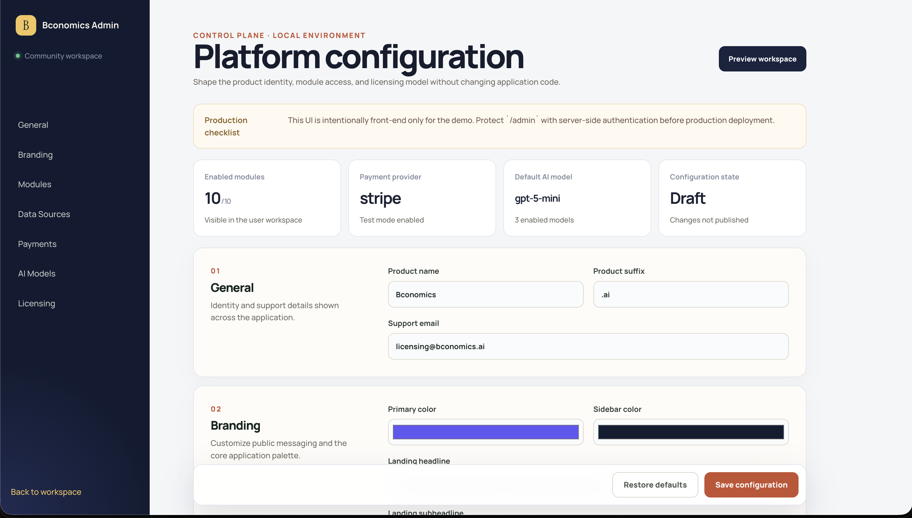<br />
      <sub>Admin Console</sub>
    </td>
  </tr>
</table>

## Current features

- Responsive landing page and dashboard shell
- Mobile drawer navigation and collapsible sidebar groups
- Configurable branding, logo, and public messaging
- Admin-managed landing page header, content, footer navigation, and legal-link configuration
- Module and Partner Portal feature flags
- Searchable and filterable listing views with record details
- Three-step Quick Generate workflow with validation, draft recovery, company import, and generated previews
- Google Sheets and Airtable funding data-source integrations
- Admin data-source search, create, edit, delete, enable, and manual sync controls
- Dynamic Grants & Loans directory with source attribution and Quick Generate import
- PostgreSQL-backed persistence with local offline fallback and first-run migration
- Database migrations, demo seed data, audit logs, and Docker Compose setup
- Route-specific titles, metadata, and a dedicated 404 page
- Vitest checks and a GitHub Actions verification workflow
- Dual-license foundation for open-source and commercial distribution

## Tech stack

- React 19
- TypeScript
- Vite
- React Router
- Oxlint
- Express
- PostgreSQL 17
- Zod

## Local development

```bash
npm install
npm run db:setup
npm run dev
```

Open [http://localhost:5173](http://localhost:5173).

Copy `.env.example` to `.env` before changing database credentials or ports.
`npm run dev` starts both the API on port `8787` and Vite on port `5173`.

### Stripe setup

The billing flow now supports Stripe Checkout and the Stripe customer portal.

1. Copy `.env.example` to `.env`.
2. Add your Stripe server credentials:
   - `STRIPE_TEST_SECRET_KEY`
   - `STRIPE_LIVE_SECRET_KEY`
   - `STRIPE_WEBHOOK_SECRET`
   - `APP_STATE_ENCRYPTION_KEY`
3. Start the app with `npm run dev`.
4. Open `/admin#payments` and confirm these Stripe references:
   - `testSecretKeyReference` -> `STRIPE_TEST_SECRET_KEY`
   - `liveSecretKeyReference` -> `STRIPE_LIVE_SECRET_KEY`
   - `webhookSecretReference` -> `STRIPE_WEBHOOK_SECRET`
5. Save the Admin Console configuration in the browser.
   Platform settings now stay local-only and are not synchronized into PostgreSQL.
   Raw payment secrets are stored locally in encrypted browser storage rather than
   plaintext localStorage.
6. In the Stripe Dashboard, register your webhook endpoint, for example:
   - `http://localhost:8787/api/webhooks/stripe`

If the checkout success, cancel, or billing-portal return URLs are left blank in
the Admin Console, the server automatically falls back to the current app origin
and routes users back to `/settings#billing`.

## Scripts

```bash
npm run dev
npm run build
npm run lint
npm run test
npm run check
npm run preview
npm run db:up
npm run db:migrate
npm run db:seed
npm run db:down
```

## Project structure

```text
src/
  config/       Platform configuration and persistence
  data/         Navigation and demo records
  lib/          Domain and generation helpers
  pages/        Landing, dashboard, and admin surfaces
  persistence/  PostgreSQL synchronization and offline fallback
server/
  db/           PostgreSQL pool, migrations, and seed data
  app.ts        API routes and validation
  stateRepository.ts
```

## Admin configuration

The Admin Console now keeps platform settings in local browser storage only.
Those settings are not synchronized to the API or PostgreSQL. Sensitive payment
fields are stored in encrypted browser storage, while synced data-source records
continue to use the API-backed persistence layer. The server validates a strict
state-key allowlist so session tokens and local-only settings cannot be written
to the state database.

The landing page can be managed directly from `/admin#landing-page`, including:

- header navigation items and signed-in or signed-out CTA labels
- grouped content sections for hero, CTA copy, features, workflow, and open-source messaging
- dynamic proof points shown on the public homepage
- footer sitemap links, platform links, and legal link destinations

Payment settings under `/admin#payments` now focus on gateway configuration:

- Stripe and Waffo Pancake can each store separate test and live secret references
- environment-variable names remain visible as references
- raw payment keys are redacted in localStorage and stored in encrypted browser storage
- checkout success and cancel URLs can be overridden per deployment
- customer self-serve subscription changes use the Stripe billing portal
- webhook signature verification uses server environment variables rather than synced admin state

Stripe checkout remains the only live billing flow wired to the server today.
Waffo Pancake is available in the Admin Console as a configurable gateway option
for secret and mode management.

Before production deployment:

1. Replace the demo auth flow and seeded development identity with production authentication and user provisioning.
2. Add role-based authorization for founder, advisor, admin, and partner workflows.
3. Add row-level workspace authorization before accepting user-supplied IDs.
4. Keep production secrets in a secret manager and use Admin only for references or encrypted-at-rest secure storage.
5. Configure TLS and a managed PostgreSQL backup policy.

## PostgreSQL persistence

The API stores the current product state in PostgreSQL using three scopes:

- `platform` for branding, modules, AI/payment configuration, and data sources
- `workspace` for companies, applications, saved programs, and generated documents
- `user` for personal settings, pinned resources, and active workspace selection

Sensitive payment keys inside `bconomics-platform-config-v1` are not returned to
the browser in plaintext. The API redacts them in bootstrap payloads, encrypts
raw values before saving them to PostgreSQL, and decrypts them only for
server-side payment operations.

On first connection, existing supported browser state is uploaded automatically.
On later visits, PostgreSQL is loaded before the React application mounts. Mutations
are debounced and written in batches, and every database mutation creates an audit
record.

See [docs/DATABASE.md](./docs/DATABASE.md) for the schema, API contract, deployment
guidance, and migration path toward fully normalized domain tables.

## Workspace data sources

Open `/admin#data-sources` to manage the sources that populate Grants & Loans,
Templates, Social Resources, and Tools. Administrators can search and filter by
module, change a source's destination, enable or disable it, and run a manual sync.
Synchronized records are cached locally in the demo and become available in their
selected workspace module.

Supported columns are:

```text
Program Name, Type, Provider, Amount, Deadline, Match, URL, Location
```

Common alternatives such as `Name`, `Agency`, `Maximum Amount`, `Closing Date`,
and `Region` are mapped automatically.

Templates, Social Resources, and Tools use:

```text
Title, Description, Category, Status, URL, Updated
```

Alternatives such as `Name`, `Summary`, `Format`, `Channel`, `Link`, and
`Last Updated` are also recognized.

### Google Sheets

Paste a public or link-readable Google Sheets URL and optionally provide the sheet
tab name. The frontend converts the sharing URL to CSV and imports the rows. The
included funding, template, and tools CSV files can be used to test the sync flow
without an external account.

### Airtable

Airtable synchronization uses a server-side proxy so the personal access token is
never stored in the browser. Configure the base ID, table, view, proxy URL, and
environment-variable name in Admin.

The integration proxy receives:

```json
{
  "provider": "airtable",
  "baseId": "appXXXXXXXXXXXXXX",
  "tableName": "Funding Programs",
  "view": "Published",
  "credentialReference": "AIRTABLE_ACCESS_TOKEN"
}
```

It should return either an array of field objects or the Airtable-style shape:

```json
{
  "records": [
    {
      "fields": {
        "Program Name": "Community Growth Loan",
        "Type": "Loan",
        "Amount": 50000
      }
    }
  ]
}
```

Protect the proxy with administrator authorization, validate the requested base and
table against an allowlist, and read the Airtable token from server-side environment
variables.

## Licensing

OpenBcon uses a dual-license structure:

- Community edition: `AGPL-3.0-or-later`
- Commercial edition: available by separate paid agreement

The commercial edition is intended for customers that need:

- proprietary or closed-source deployment rights
- private modifications without AGPL disclosure obligations
- white-label, OEM, or embedded distribution rights
- paid implementation, customization, or ongoing support

In the community edition, OpenBcon attribution in the landing page and dashboard footer is required. Commercial license holders can negotiate white-label controls, including whether that attribution is visible.

See [COMMERCIAL-LICENSE.md](./COMMERCIAL-LICENSE.md) for the commercial
licensing model and [CLA.md](./CLA.md) for the contributor agreement required
for external contributions.

## Publishing to GitHub

```bash
git init
git add .
git commit -m "Initial open source release"
git branch -M main
git remote add origin <your-repository-url>
git push -u origin main
```

Do not commit production credentials, customer data, generated documents, or third-party assets that you do not have the right to redistribute.
